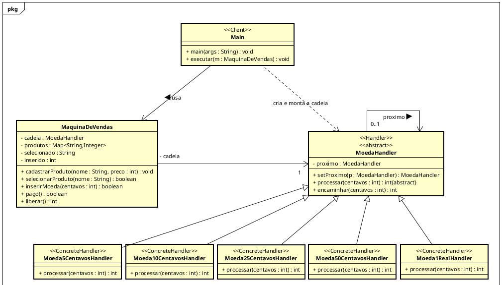

# Etapa 1 — Diagrama UML

O diagrama com os papéis do padrão Chain of Responsibility:

- `MoedaHandler`: Handler
- `Moeda5CentavosHandler`, `Moeda10CentavosHandler`, `Moeda25CentavosHandler`, `Moeda50CentavosHandler` e `Moeda1RealHandler`: ConcreteHandler
- `Main`: Client
- `MaquinaDeVendas`: guarda o primeiro handler da cadeia

  

## Próxima etapa

[v2-p1 — implementação e revisão crítica](https://github.com/Thalisson-Souza/APSOO-chain-of-responsibility/tree/v2-p1)
